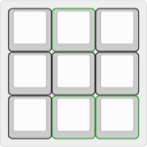
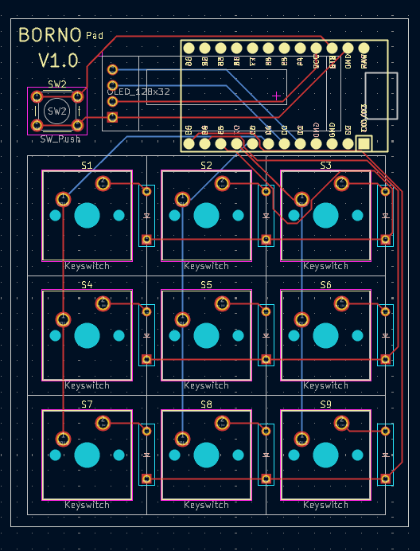

  <!-- Replace with your logo when ready -->
  

# BORNO MK1 – 3x3 Macropad

This is the first project of **BORNO**, a 3x3 macropad powered by **QMK firmware**.  
It uses an **Arduino Pro Micro** as the controller and **MX-style switches**.  
The design is simple, compact, and customizable — a perfect starting point for experimenting with custom keyboards.  

---

## 🔹 Layout

  

---

## 🔹 PCB

  

- [Download Gerber Files](hardware/gerbers.zip)

---

## 🔹 Firmware
  Download QMK Firmware for BORNO
- [Precompiled HEX File](firmware/hex/borno_mk1_default.hex)
- Or change according to your need.

---

## 🔹 Photos
Here are some photos from the build process and the finished macropad:  

  
  
  

---

## 📜 License
This project is licensed under the [MIT License](LICENSE).
